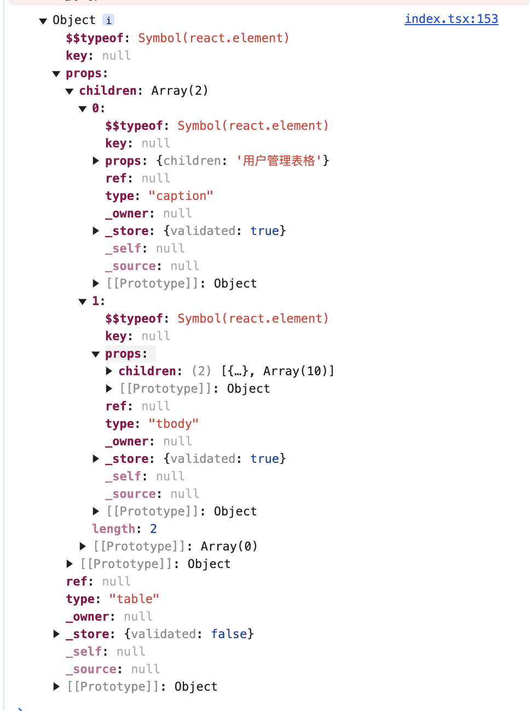

# 介绍

建造一个小型的 React。

# 渲染流程

状态 => JSX => createElement => 虚拟 DOM 对象 => render => 真实 DOM

状态改变后，上述渲染流程重新执行。

```tsx
import { transformSync } from '@babel/core';
import reactPreset from '@babel/preset-react';

const jsx = `<table>
        <caption>用户管理表格</caption>
        <tbody>
            <tr>
                <th scope="col">id</th>
                <th scope="col">姓名</th>
                <th scope="col">头像</th>
                <th scope="col">性别</th>
                <th scope="col">电话</th>
            </tr>
            {users.map((user) => (
                <tr>
                    <td>{user.id}</td>
                    <td>{user.familyName + user.givenName}</td>
                    <td>
                        
                    </td>
                    <td>{user.gender}</td>
                    <td>{user.phone}</td>
                </tr>
            ))}
        </tbody>
    </table>`;

const result = transformSync(jsx, {
    presets: [reactPreset],
});

// webpack 插件将 jsx 转为 createElement
console.log(result.code);

/*#__PURE__*/ React.createElement(
    'table',
    null,
    /*#__PURE__*/ React.createElement('caption', null, '\u7528\u6237\u7BA1\u7406\u8868\u683C'),
    /*#__PURE__*/ React.createElement(
        'tbody',
        null,
        /*#__PURE__*/ React.createElement(
            'tr',
            null,
            /*#__PURE__*/ React.createElement(
                'th',
                {
                    scope: 'col',
                },
                'id',
            ),
            /*#__PURE__*/ React.createElement(
                'th',
                {
                    scope: 'col',
                },
                '\u59D3\u540D',
            ),
            /*#__PURE__*/ React.createElement(
                'th',
                {
                    scope: 'col',
                },
                '\u5934\u50CF',
            ),
            /*#__PURE__*/ React.createElement(
                'th',
                {
                    scope: 'col',
                },
                '\u6027\u522B',
            ),
            /*#__PURE__*/ React.createElement(
                'th',
                {
                    scope: 'col',
                },
                '\u7535\u8BDD',
            ),
        ),
        users.map((user) =>
            /*#__PURE__*/ React.createElement(
                'tr',
                null,
                /*#__PURE__*/ React.createElement('td', null, user.id),
                /*#__PURE__*/ React.createElement('td', null, user.familyName + user.givenName),
                /*#__PURE__*/ React.createElement(
                    'td',
                    null,
                    /*#__PURE__*/ React.createElement('img', {
                        src: user.avatar,
                    }),
                ),
                /*#__PURE__*/ React.createElement('td', null, user.gender),
                /*#__PURE__*/ React.createElement('td', null, user.phone),
            ),
        ),
    ),
);

// createElement 实际执行结果为虚拟 DOM 对象


// render 函数
function render(element, container) {
  const dom =
    element.type == "TEXT_ELEMENT"
      ? document.createTextNode("")
      : document.createElement(element.type)
​
  const isProperty = key => key !== "children"
  Object.keys(element.props)
    .filter(isProperty)
    .forEach(name => {
      dom[name] = element.props[name]
    })
​
  element.props.children.forEach(child =>
    render(child, dom)
  )
​
  container.appendChild(dom)
}
```

# 时间分片

将渲染任务分片在空闲时间执行。

```ts
interface FiberNode {
    type: 'TEXT_ELEMENT' | keyof HTMLElementTagNameMap;
    props: {
        children: FiberNode[];
    } & Record<string, unknown>;
    dom?: HTMLElement | Text | null;
    child?: FiberNode;
    parent?: FiberNode;
    sibling?: FiberNode;
}

const createDOM = (fiberNode: FiberNode) => {
    const dom = fiberNode.type == 'TEXT_ELEMENT' ? document.createTextNode('') : document.createElement(fiberNode.type);
    const isProperty = (key: string) => key !== 'children';
    Object.keys(fiberNode.props)
        .filter(isProperty)
        .forEach((name) => {
            dom[name] = fiberNode.props[name];
        });
    return dom;
};

const performUnitOfWork = (fiberNode: FiberNode) => {
    if (!fiberNode.dom) fiberNode.dom = createDOM(fiberNode);
    let preSibling: FiberNode | null = null;
    for (let i = 0; i < fiberNode.props.children.length; i++) {
        const curSibling = fiberNode.props.children[i];
        const curSiblingFiber: FiberNode = {
            type: curSibling.type,
            props: curSibling.props,
            parent: curSibling,
            dom: null,
        };
        if (i === 0) fiberNode.child = curSiblingFiber;
        else preSibling!.sibling = curSibling;
        preSibling = curSiblingFiber;
    }
    if (fiberNode.child) return fiberNode.child;
    let nextFiber: FiberNode | undefined = fiberNode;
    while (nextFiber) {
        if (nextFiber.sibling) {
            return nextFiber.sibling;
        }
        nextFiber = nextFiber.parent;
    }
};

let nextUnitOfWork: FiberNode | null | undefined = null;
let workInProgressRoot: FiberNode | null | undefined = null;

const commitWork = (fiber: FiberNode | null | undefined) => {
    if (!fiber) return;
    if (!fiber.parent) return;
    const domParent = fiber.parent.dom;
    if (!domParent) return;
    if (fiber.dom) domParent.appendChild(fiber.dom);
    commitWork(fiber.child);
    commitWork(fiber.sibling);
};

function commitRoot() {
    commitWork(workInProgressRoot?.child);
    workInProgressRoot = null;
}

const workLoop: IdleRequestCallback = (deadline) => {
    let shouldYield = false;
    while (nextUnitOfWork && !shouldYield) {
        nextUnitOfWork = performUnitOfWork(nextUnitOfWork);
        shouldYield = deadline.timeRemaining() < 5;
    }
    if (!nextUnitOfWork && workInProgressRoot) {
        commitRoot();
    }
    window.requestIdleCallback(workLoop);
};
window.requestIdleCallback(workLoop);

const render = (element, container: HTMLElement) => {
    workInProgressRoot = {
        type: 'div',
        dom: container,
        props: {
            children: [element],
        },
    };
    nextUnitOfWork = workInProgressRoot;
};
```
